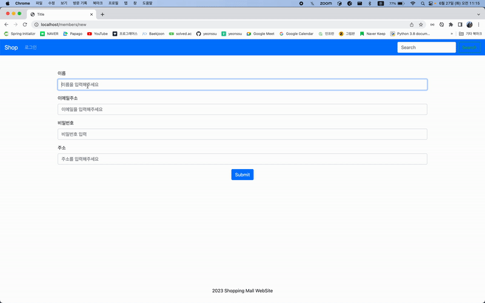
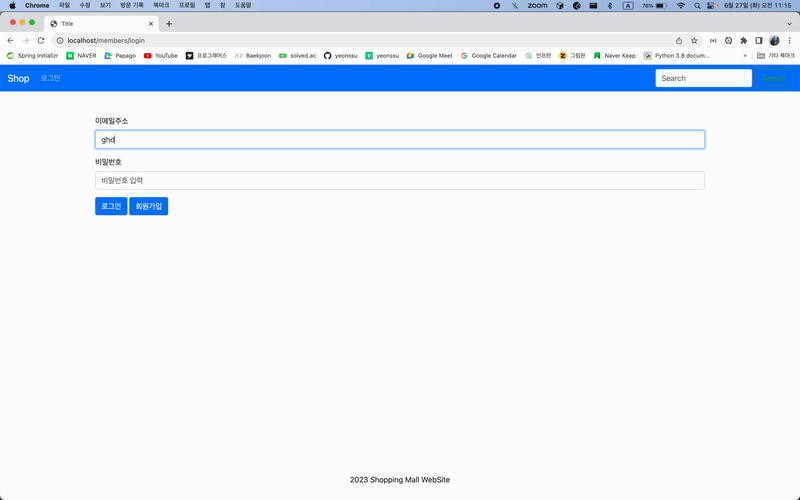
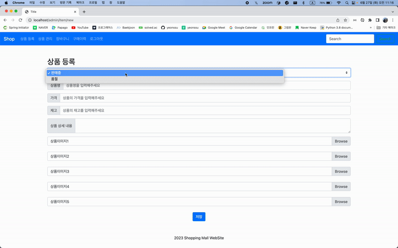
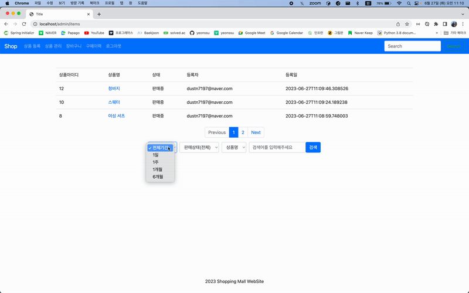

# Shopping Mall Project

   
  
   

* 학습 용도 프로젝트
* 참고 도서 : 스프링 부트 쇼핑몰 프로젝트 with JPA
* Duration : 2022.12 - 2023.06
* 주요 특징
  * SSR 방식 Spring Boot 프로젝트
  * Spring Data JPA 기초
  * Junit을 이용한 테스트 코드 작성
  * Thymeleaf를 이용한 화면 구성
  * Spring Security를 이용한 회원 인증 및 인가

 

## 💻 Stacks Used
|   Java   |   Spring   |   Spring Boot   |                                         Spring Security                                         |   MySQL   | thymeleaf |
| :----------------------------------------------------------: | :----------------------------------------------------------: | :----------------------------------------------------------: |:-----------------------------------------------------------------------------------------------:| :----------------------------------------------------------: |  :----------------------------------------------------------: |
| 

 |  |  |  | 

 | 

 |

 

## 📌 Introduction to Project Features

### 회원가입

### 로그인

### 메인 화면

### 상품 등록

### 상품 관리

### 상품 상세

### 장바구니 및 주문

 

## 📢 Github Rule

### Commit Convention

|  Message   | 설명                                                  |
| :--------: | :---------------------------------------------------- |
| `add` | 새로운 프로젝트, 파일 등 추가 |
| `feat` | 새로운 기능 추가 |
| `fix` | 버그 수정 |
| `refactor` | 코드 리팩토링 |
| `style` | 코드 포맷팅, 세미콜론 누락, 코드 스타일 변경 등 |
| `remove` | 사용하지 않는 파일 또는 폴더 삭제 |
| `rename` | 파일 또는 폴더명 수정 |
| `chore` | 빌드 업무 수정, 패키지 매니저 수정 |
